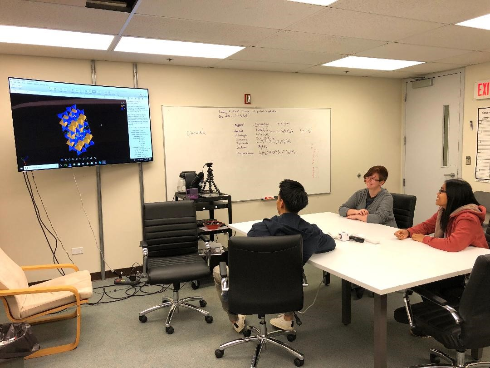

One of the first goals of the Consortium is to develop an undergraduate, team-taught Materials Science course with a focus on 
synthesis and characterization methods. In this “Materials Synthesis and Characterization” course, we envision an in-class, hands-on, undergraduate 
research lab experience in which students create a sample and characterize it during class time, working on equipment and instruments in the Consortium 
members’ labs. The course will satisfy the DP (physical science) and DY (laboratory) diversification requirements, and will act as a pipeline into the 
Undergraduate Materials Research Program (see below). In the initial course, samples synthesized and analyzed in-class will be relevant to renewable 
energy, and this may change in subsequent years as the Consortium evolves. We will seek cross-listing in multiple Colleges and Schools (e.g., ME, CEE, EE, 
GG, PHYS, CHEM). This hands-on class will complement Materials Science-related lectures such as ME 331, PHYS 440 and CEE 375 and may be listed in COE’s 
proposed Biomedical Engineering degree. Getting students into the lab within the framework of a class and working on societally-relevant problems pulls 
them into research which, in turn, fires students’ imagination, motivation and desire to continue learning.

