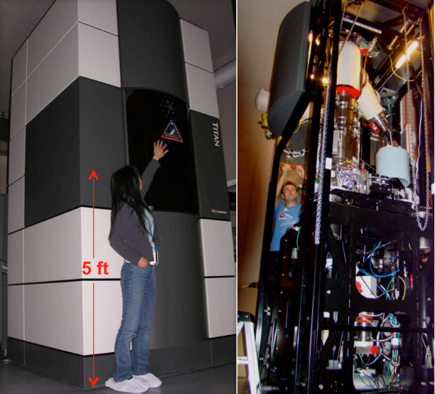
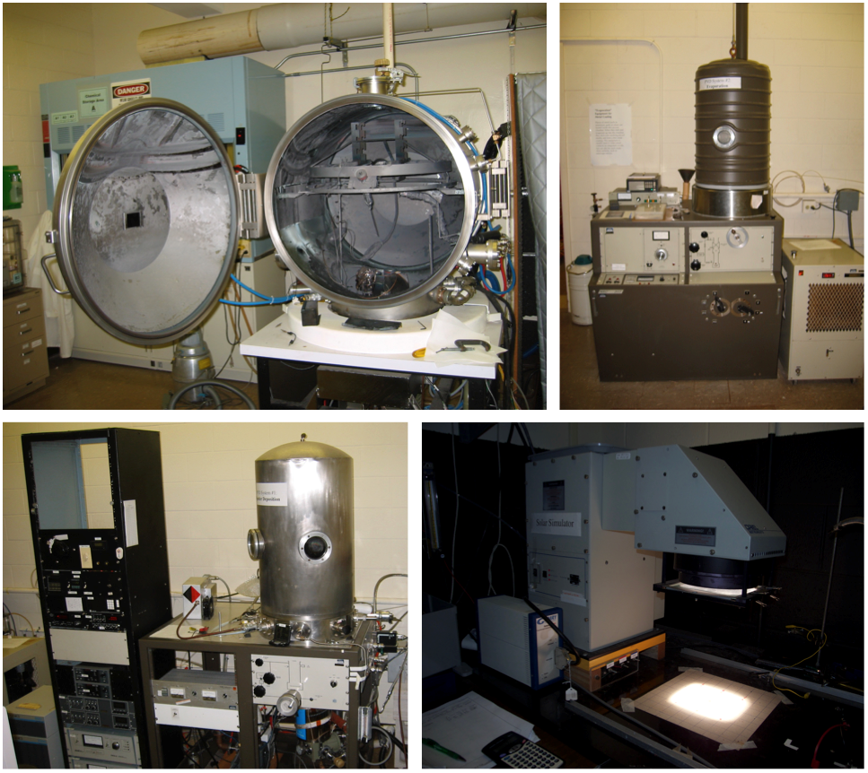

<h3>List of MSCoRE facilities:</h3>
[Advanced Electron Microscopy Center](#hope)
 
[X-ray Atlas Advanced Diffraction Lab](#xray)
 
[Thin Films Laboratory](#nico)

The ability to characterize the chemical composition, structure, texture, heterogeneities (and defects), and interfaces at macro- to 
nano-scales, and relate this information to relevant physical properties is the foundation of modern materials science and engineering. 
At UHM, we have access to a comprehensive suite of state-of-the-art instrumentation in the labs of the participating MSCoRE faculty members 
and senior staff.
In interdisciplinary science, sharing physical space and research facilities, and bringing to the table individuals with diverse 
perspectives and insights, is essential to stimulate a creative exchange of ideas, move outside of traditional disciplinary boundaries, 
and make transformative leaps forward in knowledge. In MSCoRE, we aim to create such a collaborative environment. 

<h3>Advanced Electron Microscopy Center</h3>

The Advanced Electron Microscopy Center is part of the School of Ocean and Earth Science and Technology, and is managed by Dr. Hope Ishii. 
The Center features electron and ion microscopy instruments for sample analysis, and additional tools and instruments for small sample 
preparation. The Center boasts a world-class, state-of-the-art aberration-corrected TEM/STEM and FIB (described below), the only 
instruments of their kind in the state of Hawaii. Together, these tools enable micro- and nano-scale characterization of the chemistry 
(elemental composition, oxidation states, bonding) and structure (crystalline/amorphous structure, defects, interfaces) that provide the 
foundation for understanding processing-property relationships in the photocatalytic, battery and high-pressure materials, recycling and 
water purification, and nanodevice developments (detectors/sensors).
 
<b>FEI Titan3 G2 60-300 “SuperSTEM”:</b> The Titan is an aberration-corrected (scanning) transmission electron microscope, or TEM/STEM, that has 
an environmental enclosure for improved noise isolation, as well as a monochromator and dual spherical aberration correctors for 
the probe and image in. It is aligned for operation at 80, 200 and 300 kV. It is equipped with a high angle annular dark field (HAADF) 
detector, Gatan Tridiem GIF (Gatan imaging filter) for imaging and spectroscopy and an EDAX Genesis 4000 Si(Li) solid state energy 
dispersive x-ray spectrometer with ultrathin window. Sub-Ångström spatial resolution and energy resolutions of 100-150 meV at 200 kV and 
150-200 meV at 300 kV are routinely achievable. EDX elemental detection limits are down to a few ppm for long count times on robust samples. 
The TEM/STEM will be applied to assess photovoltaic and battery samples, water purification materials and newly developed high-pressure 
materials.
 
<b>Dual beam Helios focused ion beam instrument (FIB):</b> A companion instrument to the Titan (S)TEM, the FEI Helios NanoLab 660 dual-beam Focused 
Ion Beam (FIB) microscope combines a Schottky field emission secondary electron microscope (SEM) electron column and Tomahawk ion column in 
the same instrument. The FIB is equipped with a silicon-drift energy dispersive X-ray detector for elemental analyses and a retractable 
backscatter detector and retractable STEM detector with bright field, dark field and high angle annular dark field segments for imaging 
in addition to in-column secondary electron detectors. An in situ micromanipulator and C, W and Pt deposition capabilities enable 
nanometer-scale deposition and milling for nano-surgery, nano-engineering and TEM sample preparation. The FIB achieves 0.6 nm 
electron-beam resolution at 15 kV and 4 nm ion-beam resolution at 30 kV. The FIB will be used for sample preparation for TEM/STEM, 
assessment of material chemistry, texture, and morphology and for nanodevice modifications.
 
<b>Supporting Equipment:</b> Other equipment in the Center to support materials science research includes a vacuum oven and soft-walled cleanroom 
with a Zeiss stereomicroscope, Nikon petrographic optical microscope, digital camera and image capture software, and a Leica Ultracut EM 
UC7 ultramicrotome for embedded sample preparation of thin sections for TEM/STEM analysis.
 
[Back to top](#top)

<h3>Thin Films Laboratory</h3>

The Thin Films Laboratory, managed by Dr. Nicolas Gaillard, is a unique facility at UHM within the Hawaii Natural Energy Institute. It is located in a 
1,500 sq. ft. facility, and contains sophisticated, state-of-the-art equipment for the fabrication of thin film materials and devices. The Thin Films Lab 
enables synthesis of photovoltaic and other thin-film structures. Major equipment required for the synthesis of thin-film materials 
and their characterization are available inside the laboratory, including 2 co-evaporation chambers and 2 sputtering systems. These vacuum chambers 
can be used to synthesize promising material classes for solar energy conversion, including chalcopyrites (CuInGaSe) and metal oxides (WO3, TiO2, CuWO4). 
These chambers can also be used to deposit standard materials required for manufacturing solar cells, such as Mo and Ni/Al metal contacts, as well as 
transparent conductive oxides (ITO and ZnO). The Thin Films Lab is also equipped with centrifuges and spin coaters to develop non-vacuum fabrication 
techniques for low cost photovoltaics (ink-based processes). The laboratory also operates 3 tube furnaces with annealing capabilities up to 1,600°C and 
is equipped with standard characterization equipment, including a profilometer, a 5-channel potentiostat, a 4-point probe apparatus, 2 solar simulators, 
a spectro-radiometer for light intensity calibration, a quantum efficiency measurement system and a UV-visible spectrometer. 
 
[Back to top](#top)