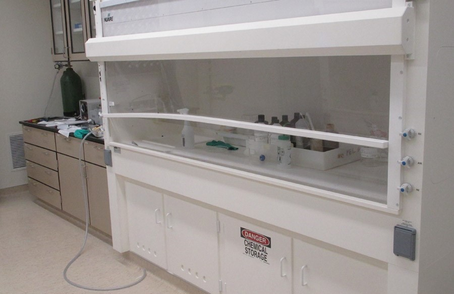

<h3>List of MSCoRE facilities:</h3>
[Advanced Electron Microscopy Center](#hope)
 
[X-ray Atlas Advanced Diffraction Lab](#xray)
 
[Thin Films Laboratory](#nico)
 
[Battery prototyping and testing laboratories](#matthieu)
 
[Microfabrication Cleanroom](#cleanroom)
 
[Thermofluids Laboratory](#shin)
 
[Nano/Micro Structures and Devices Lab](#brown)
 
[Laboratory of Biocolloids and Biointerfaces](#zuo)
 
[Hawaii Nanotechnology Laboratory](#nejhad)

The ability to characterize the chemical composition, structure, texture, heterogeneities (and defects), and interfaces at macro- to 
nano-scales, and relate this information to relevant physical properties is the foundation of modern materials science and engineering. 
At UHM, we have access to a comprehensive suite of state-of-the-art instrumentation in the labs of the participating MSCoRE faculty members 
and senior staff.
In interdisciplinary science, sharing physical space and research facilities, and bringing to the table individuals with diverse 
perspectives and insights, is essential to stimulate a creative exchange of ideas, move outside of traditional disciplinary boundaries, 
and make transformative leaps forward in knowledge. In MSCoRE, we aim to create such a collaborative environment. 

<h3>Advanced Electron Microscopy Center</h3>

The Advanced Electron Microscopy Center is part of the School of Ocean and Earth Science and Technology, and is managed by Dr. Hope Ishii. 
The Center features electron and ion microscopy instruments for sample analysis, and additional tools and instruments for small sample 
preparation. The Center boasts a world-class, state-of-the-art aberration-corrected TEM/STEM and FIB (described below), the only 
instruments of their kind in the state of Hawaii. Together, these tools enable micro- and nano-scale characterization of the chemistry 
(elemental composition, oxidation states, bonding) and structure (crystalline/amorphous structure, defects, interfaces) that provide the 
foundation for understanding processing-property relationships in the photocatalytic, battery and high-pressure materials, recycling and 
water purification, and nanodevice developments (detectors/sensors).
 
<b>FEI Titan3 G2 60-300 “SuperSTEM”:</b> The Titan is an aberration-corrected (scanning) transmission electron microscope, or TEM/STEM, that has 
an environmental enclosure for improved noise isolation, as well as a monochromator and dual spherical aberration correctors for 
the probe and image in. It is aligned for operation at 80, 200 and 300 kV. It is equipped with a high angle annular dark field (HAADF) 
detector, Gatan Tridiem GIF (Gatan imaging filter) for imaging and spectroscopy and an EDAX Genesis 4000 Si(Li) solid state energy 
dispersive x-ray spectrometer with ultrathin window. Sub-Ångström spatial resolution and energy resolutions of 100-150 meV at 200 kV and 
150-200 meV at 300 kV are routinely achievable. EDX elemental detection limits are down to a few ppm for long count times on robust samples. 
The TEM/STEM will be applied to assess photovoltaic and battery samples, water purification materials and newly developed high-pressure 
materials.
 
<b>Dual beam Helios focused ion beam instrument (FIB):</b> A companion instrument to the Titan (S)TEM, the FEI Helios NanoLab 660 dual-beam Focused 
Ion Beam (FIB) microscope combines a Schottky field emission secondary electron microscope (SEM) electron column and Tomahawk ion column in 
the same instrument. The FIB is equipped with a silicon-drift energy dispersive X-ray detector for elemental analyses and a retractable 
backscatter detector and retractable STEM detector with bright field, dark field and high angle annular dark field segments for imaging 
in addition to in-column secondary electron detectors. An in situ micromanipulator and C, W and Pt deposition capabilities enable 
nanometer-scale deposition and milling for nano-surgery, nano-engineering and TEM sample preparation. The FIB achieves 0.6 nm 
electron-beam resolution at 15 kV and 4 nm ion-beam resolution at 30 kV. The FIB will be used for sample preparation for TEM/STEM, 
assessment of material chemistry, texture, and morphology and for nanodevice modifications.
 
<b>Supporting Equipment:</b> Other equipment in the Center to support materials science research includes a vacuum oven and soft-walled cleanroom 
with a Zeiss stereomicroscope, Nikon petrographic optical microscope, digital camera and image capture software, and a Leica Ultracut EM 
UC7 ultramicrotome for embedded sample preparation of thin sections for TEM/STEM analysis.
 
[Back to top](#top)

<h3>X-Ray Atlas Advanced Diffraction Laboratory</h3>

The X-ray diffraction laboratory at HIGP is managed by Dr. Przemyslaw Dera. The Atlas X-ray Diffraction system is a state of the art instrument being developed 
within the current NSF EAR Infrasture and Facilities project #1541516. 
The instrument is composed of two commercial X-ray diffractometers: (1) a Bruker D8 Venture single crystal instrument with high-brilliance Incoatec IuS 3.0 
AgKa microfocus source and Helios focusing optics, and innovative Photon II CPAD detector, and (2) a Bruker D8 Advance high resolution Bragg-Brentano powder 
diffractometer. The D8 Venture diffractometer has been customized with a range of new unique capabilities including: (1) motorized XYZ stage as an alternative 
heavy-duty sample mounting platform for high-pressure, high-temperature diamond anvil, ore other, environmental/ in-operando cells, including resistively 
heated and/or controlled gas-atmosphere devices, (2) fiber optics Raman spectrometer for ruby fluorescence measurements, and (3) photodiode detector, which 
can be utilized for automated X-ray absorption/transmission scanning during diamond anvil cell experiments and Amptek fastSSD energy dispersive detector allowing 
mico X-ray fluorescence measurements. X-ray Atlas can be used for in situ X-ray diffraction experiments, thin film structural characterization and battery ex situ 
and in operando experiments, as well as routine structure characterisation of powders, ceramics, rock and environmental solid samples.
 
Close collaboration with the instrument manufacturing company, Bruker AXS allows us to develop and test innovative experimental approaches. 
The extreme materials research group strongly emphasizes technology and information transfer through our user facility, PX^2 at Argonne National Lab, 
and to other university-based labs outside of Hawaii. Our group also develops open-source data analysis software GSE_ADA/ATREX, which is widely used in the high 
pressure crystallography field, and regularly offer training workshops. 
 
[Back to top](#top)

<h3>Thin Films Laboratory</h3>

The Thin Films Laboratory, managed by Dr. Nicolas Gaillard, is a unique facility at UHM within the Hawaii Natural Energy Institute. It is located in a 
1,500 sq. ft. facility, and contains sophisticated, state-of-the-art equipment for the fabrication of thin film materials and devices. The Thin Films Lab 
enables synthesis of photovoltaic and other thin-film structures. Major equipment required for the synthesis of thin-film materials 
and their characterization are available inside the laboratory, including 2 co-evaporation chambers and 2 sputtering systems. These vacuum chambers 
can be used to synthesize promising material classes for solar energy conversion, including chalcopyrites (CuInGaSe) and metal oxides (WO3, TiO2, CuWO4). 
These chambers can also be used to deposit standard materials required for manufacturing solar cells, such as Mo and Ni/Al metal contacts, as well as 
transparent conductive oxides (ITO and ZnO). The Thin Films Lab is also equipped with centrifuges and spin coaters to develop non-vacuum fabrication 
techniques for low cost photovoltaics (ink-based processes). The laboratory also operates 3 tube furnaces with annealing capabilities up to 1,600°C and 
is equipped with standard characterization equipment, including a profilometer, a 5-channel potentiostat, a 4-point probe apparatus, 2 solar simulators, 
a spectro-radiometer for light intensity calibration, a quantum efficiency measurement system and a UV-visible spectrometer. 
 
[Back to top](#top)

<h3>Battery prototyping and testing laboratories</h3>

The HNEI battery testing and prototyping laboratories are managed by Dr. Matthieu Dubarry. The prototyping laboratory is located at the main University of 
Hawaii at Mānoa campus. It hosts sophisticated state-of-the-art equipment for the synthesis of active materials, the fabrication of electrodes, their 
assembly in prototype cells and their testing (Fig. F6). Major equipment includes an Argon-filled glove box and several battery testers, including 15 
channels for prototype testing, as well as several temperature chambers, ceramic ovens, a UV-visible spectrometer and an ellipsometer. The laboratory 
is also equipped with several commercial Li-ion battery testers for single-cell and battery-pack testing that are used to develop battery management 
systems algorithms.
 
The new state-of-the-art HNEI battery-testing laboratory is located at HNEI’s Hawaii Sustainable Energy Research Facility (HiSERF) in downtown Honolulu 
and has been operational since April 15, 2015. Within this new laboratory, latest generation battery testers are used in tandem with temperature chambers 
to carry out calendar and cycle aging testing on single cells and modules. A total of 86 channels are available that are capable of sourcing and sinking 
from 25 to 100 A, at voltages ranging from 5 to 60 V. The battery-testing laboratory has been designed with safety in mind. All batteries are tested inside 
temperature chambers and the laboratory itself is built in a retrofitted industrial fridge with its own air conditioning and ventilation system to provide 
complete isolation from the rest of the facility. Additionally, each temperature chamber is equipped with smoke, CO2 and H2 sensors to detect any gassing, 
signal to automatically shut down all the testing, purge the chamber with nitrogen, sound a warning alarm, and notify authorized personnel. 
 
[Back to top](#top)

<h3>Microfabrication Cleanroom</h3>

The UH College of Engineering maintains an on-campus dedicated microfabrication cleanroom equipped with 
mask aligners (OAI, JBA), spin coater (SCS), UV lamp, hotplate, two ovens, wire bonders, refrigerator, 
acid fume hood, oxidation furnaces, electrochemical deposition capabilities, wet-etch stations, HF vapor-phase 
etching, a wet station, and a flammable cabinet. This facility is capable of performing the soft lithography 
required for microfluidics research. It is also equipped with a 3D printer for creating microfluidic molds. 
Metrology and inspection tools available in this lab include the following: 4-pt probe station, two HP digital 
oscilloscopes, an HP LCR meter, an Agilent 4155C semiconductor parameter analyzer, an HP spectrum analyzer, 
two Agilent precision power supplies, digital multimeters, a Micromanipulator wafer probing station and a 
Probing Stations wafer probing station, a Nikon photomicrography system, a Rudolf ellipsometer, two Tektronix 
curve tracers and 5 Tektronix function generators. Within the last year, the UH administration provided $150k 
for upgrades to this facility.
 
[Back to top](#top)

<h3>Thermofluids Laboratory</h3>

The Thermofluids Lab in the College of Engineering, led by Dr. Sangwoo Shin, is capable of conducting 
water-related research at various scales. The lab is equipped with microfluidics setup including inverted 
fluorescence microscope (Leica DMi8), two syringe pumps (Harvard PicoPlus Elite), and water purifier 
(Millipore DirectQ3). For large-scale filtration experiments, the lab is equipped with a dead-end type 
reverse osmosis system that is capable of operating up to 1400 psi. Other equipment located in the lab 
includes: microbalance, plasma treater, lock-in amplifier, hotplate/stirrer, convection oven, chiller, 
micropipette, sonicator, etc.
 
[Back to top](#top)

<h3>Nano/Micro Structures and Devices Lab</h3>

The Nano/Micro Structures and Devices Lab, managed by Dr. Joseph Brown, is currently being established 
for solid materials applications in the areas of nanomanufacturing and micro/nano device, system, sensor, 
and structure engineering. A wet lab space has been designated for this purpose and it is currently being 
equipped. Materials processing capabilities will include a tube furnace with controlled gas supply for 
thermochemistry experiments, a box furnace, and a fume hood. Planned characterization capabilities will 
include an optical microscope and benchtop mechanical and electrical testing. 
 
[Back to top](#top)

<h3>Laboratory of Biocolloids and Biointerfaces</h3>

The Laboratory of Biocolloids and Biointerfaces (LoBB) in the College of Engineering, 
was founded by Dr. Yi Zuo. The LoBB, focuses on general colloid and surface science 
and its applications in area of biomedical and biotechnological interest, such as biophysical 
and biomedical studies of pulmonary surfactant and self-assembled monolayers, pulmonary toxicology 
of nanomaterials and nanoparticle-based pulmonary drug delivery, development of surface tension 
and contact angle measurement methodologies, and biocolloidal systems related to particles and 
microorganisms. LoBB is equipped with an Innova AFM (Bruker, Santa Barbara, CA). The Innova AFM 
features submicron resolution and a large scanning area, up to 100x100 microns. This AFM is well 
suited for studying topography of samples and for measuring force spectroscopy. The Innova AFM is 
equipped with a fluid-imaging cell, which allows AFM scan and force measurements in a liquid medium. 
LoBB is also equipped with two home-made constrained-drop surfactometers (CDS). The CDS is well suited 
for determining the dynamic surface tension and contact angle. It can be used to study thin-film materials, 
smart surfaces, and other soft matter.
 
[Back to top](#top)

<h3>Hawaii Nanotechnology Laboratory</h3>

The HNL, directed by Dr. Ghasemi-Nejhad, is located in the Mechanical Engineering Department and is equipped 
with state of the art nanomaterials (CNTs, GNSs) and nanocomposites manufacturing.  There are CVD furnaces for 
the development of CNTs Nanoforests, which have applications in Nanocomposites (e.g. wind turbine blades) and PEMFCs 
(e.g., GDLs and CLs).  
The Laboratory is also equipped with a state-of-the-art PEMFC Test Station. There is also a 
fully automatic autoclave for composite and nanocomposite materials processing and manufacturing.
 
[Back to top](#top)

