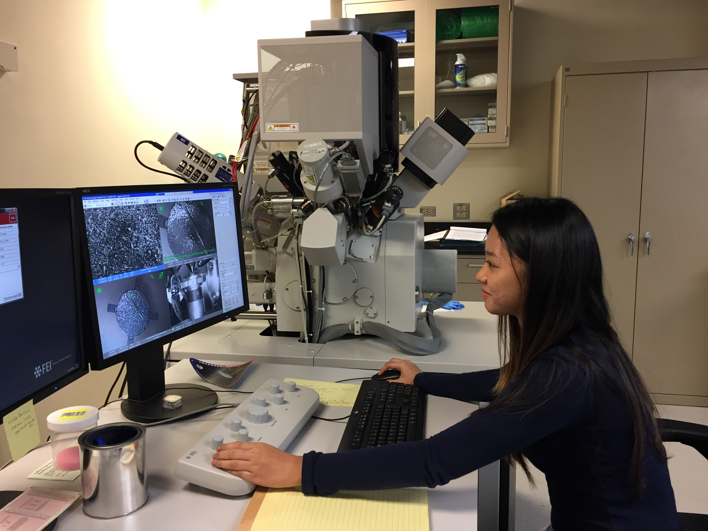

Materials Science is a major and important area of modern scientific research with direct impact on society’s technological 
progress and many attractive employment opportunities for college graduates. In the United States, it is one of the strongest 
areas of federal investment in academic research. 
Materials Science is interdisciplinary by nature and a vital part of numerous active research and education programs already 
present at UH across several Schools and Colleges. These include geophysics, planetary science, renewable energy technologies, 
advanced ceramics and nano-composites for space and aerospace, corrosion for defense, ultrathin film micro/nano devices, soft 
materials for biomedical applications, and emerging carbon-based nano-structures for water filtration, to name only a few. A 
broad spectrum of advanced, often unique, instrumentation is available.
The goal of MSCoRE is to bring the University of Hawaii materials experts scattered around several colleges and department under 
one core group. This Consortium combines Materials Science competence and infrastructure to support education, disruptive innovation 
and the foundations for a future Center for Materials Science at UH. The MSCoRE team currently consists of faculty based in the School 
of Ocean and Earth Science and Technology (SOEST), College of Engineering (COE) and Ccollege of Natural Sciences (CNS). Together, we 
bring expertise in synthesis of advanced materials and state-of-the-art analytical capabilities down to atomic resolution, including 
aberration-corrected transmission electron microscopy, scanning tunneling microscopy, focused ion beam microscopy, time-of-flight 
mass spectrometry, nuclear magnetic resonance spectroscopy, optical spectroscopies (Raman and Brillouin scattering) and advanced 
X-ray diffraction, among many others. The MSCoRE research foci revolve around renewable energy generation and storage technologies, 
as well as carbon-based nano-materials for a wide range of applications, but we expect these foci to expand and evolve as new members join. 

