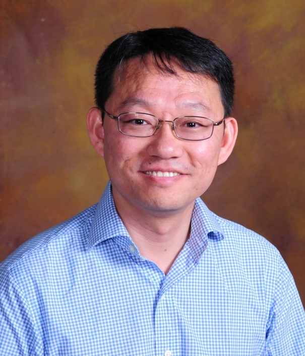

<h3>Dr. Nicolas M. Gaillard</h3>

Nicolas Gaillard (PhD, Micro- and Nano-electronics, Joseph Fourier University, Grenoble, France) has over 10 years of experience in materials science, 
with an emphasis in the areas of photovoltaics, photoelectrochemical hydrogen production and integrated circuits. Following his graduate work, Dr. Gaillard 
spent 3 years with the IBM/Motorola/STMicroelectronics alliance working on oxide/metal interfaces for CMOS transistors and DRAM memories applications. 
He joined the Thin Films Laboratory of the Hawaii Natural Energy Institute at the University of Hawaii at Manoa in 2007 as a post-doctoral, working under 
the supervision of Dr. Eric Miller on metal oxide thin films for photoelectrochemical hydrogen production. Dr. Gaillard was appointed faculty and Thin 
Films Laboratory group leader in 2010. Dr. Gaillard’s current research projects include: (i) engineering of high efficiency PEC materials, with an emphasis 
on chalcopyrite materials (CuInGaSSe) and (ii) the development of novel nanocrystal inks for printable thin film photovoltaics.
 
 

<h3>Dr. Hope A. Ishii</h3>

Nicolas Gaillard (PhD, Micro- and Nano-electronics, Joseph Fourier University, Grenoble, France) has over 10 years of experience in materials science, 
with an emphasis in the areas of photovoltaics, photoelectrochemical hydrogen production and integrated circuits. Following his graduate work, Dr. Gaillard 
spent 3 years with the IBM/Motorola/STMicroelectronics alliance working on oxide/metal interfaces for CMOS transistors and DRAM memories applications. 
He joined the Thin Films Laboratory of the Hawaii Natural Energy Institute at the University of Hawaii at Manoa in 2007 as a post-doctoral, working under 
the supervision of Dr. Eric Miller on metal oxide thin films for photoelectrochemical hydrogen production. Dr. Gaillard was appointed faculty and Thin 
Films Laboratory group leader in 2010. Dr. Gaillard’s current research projects include: (i) engineering of high efficiency PEC materials, with an emphasis 
on chalcopyrite materials (CuInGaSSe) and (ii) the development of novel nanocrystal inks for printable thin film photovoltaics.
 
 

<h3>Dr. Matthieu Dubarry</h3>

Matthieu Dubarry (PhD, Electrochemistry & Solid State Science, University of Nantes), 
has over 10 years of experience in renewable energy, with an emphasis in the area of 
lithium ion batteries. Following his PhD on the synthesis and characterization of materials 
for lithium batteries, Dr. Dubarry joined the Hawaii Natural Energy Institute at the University 
of Hawaii at Mānoa as a post-doctoral fellow in 2005 to work on the analysis of the usage of a 
fleet of electric vehicles. He was later appointed a faculty position in 2010 with a focus on 
battery testing, modeling and simulation. While working for HNEI, Dr. Dubarry pioneered the use 
of new techniques for the analysis of the degradation of Li-ion cells and developed numerous software 
tools facilitating the prognosis of Li-ion battery degradation both at the single cell and the battery
pack level. Current projects include the evaluation of grid scale Li-ion battery energy storage systems; 
the evaluation of the impact of vehicle-to-grid strategies on electric vehicle battery pack degradation; 
and the testing of emerging battery technologies for grid-connected and transportation applications.
 
 

<h3>Dr. Joseph J. Brown</h3>

Joseph J. Brown (PhD University of Colorado Boulder) has worked on a diverse array of materials and 
mechanical engineering research since 1999, centered on nanoscale device and materials engineering, 
including precision assembly, experimental mechanics, fluid processing, and applications of nanostructures 
and nanoscale systems. He joined the UHM Mechanical Engineering department in August 2017. He was previously 
a Research Scientist at the University of Colorado Boulder Department of Mechanical Engineering, and served 
there as a Lecturer in 2014-2015, teaching classes of up to 90 students. He received an A.B. in Engineering 
Sciences from Dartmouth College in 2000, and M.S. and Ph.D. degrees in Mechanical Engineering from the 
University of Colorado Boulder in 2008 and 2010, respectively. He helped found a company that provided 
nanotube textiles used on NASA’s Juno mission to Jupiter. He is author of 16 journal articles, 9 conference 
papers, and 1 book chapter, and he is an inventor of 5 U.S. patents and 11 international patents. Dr. Brown’s 
current projects include sensor fabrication using atomic layer deposition (ALD), interlocking surface 
structures for manufacturing, research into contact electrification. 
 
 

<h3>Dr. Przemyslaw Dera</h3>

Przemyslaw (Przemek) Dera is a Professor of Mineral Physics and
Extreme Materials Science at the Hawaii Institute of Geophysics and
Planetology (HIGP). He obtained his Ph.D. in physical chemistry in 2000 from Adam Mickiewicz
University in Poznan, Poland in 2000. Prior to moving to Hawaii, 
Dera worked as research scientist
at Carnegie Institution of Washington Geophysical Laboratory
(2000-2007) and University of Chicago Center for Advanced Radiation
Sources (2007-2013).  Przemek has been closely involved in the
activities of high-pressure research community both within USA, as
well as internationally.  He chaired the International Union of
Crystallography Commission on High Pressure (2008-2014) and served as
member and vice-chair the Executive Committee of COMPRES, the
Consortium for Materials Properties Research in Earth Sciences
(2010-2013). His main scientific interests include study of
pressure-induced displacive phase transitions and spin crossover
phenomena in materials, with particular emphasis on minerals relevant
to planetary interiors. Przemek is an Elected Fellow of the
Mineralogical Society of America (2013) and was selected as
Distinguished Lecturer for COMPRES in 2015. He has authored and
co-authored over 100 papers in scientific journals, 4 book chapters, and
co-edited 4 books and journal special volumes.
 
 

<h3>Dr. Craig M. Jensen</h3>

Craig Jensen received his B.S. in Chemistry from the University of California at Santa Barbara in 1979 
and worked in industry for a year before entering graduate school. He received his Ph.D. from UCLA in 
1984 and after postdoctoral research at the University of California at San Diego, he joined the University 
of Hawaii faculty in 1986.
 
 
 
 

<h3>Dr. Sangwoo Shin</h3>

Sangwoo Shin is an assistant professor in the department of mechanical engineering at the University of Hawaii at Manoa. 
He received his Ph.D. in mechanical engineering from Yonsei University in Seoul, Korea in 2012. Before joining UH Manoa 
in 2017, he worked at Princeton University as a postdoctoral research associate from 2013 to 2016. His research interests 
include transport phenomena in small-scale systems, micro/nanofluidics, electrokinetics, colloids/soft matter physics, 
targeted drug delivery, water treatment, nanowire synthesis and characterization, phase-change memory devices, two-phase 
heat transfer, etc.
 
 

<h3>Dr. Yi Zuo</h3>

Yi Zuo is a Professor in the Department of Mechanical Engineering and Adjunct Professor in the Department of Pediatrics 
in John A. Burns School of Medicine. He earned his PhD in Mechanical Engineering from the University of Toronto in 2006. 
His research interests are focused on general areas of colloid and surface science and their applications to areas of 
biomedical and biotechnological interest, such as applied surface thermodynamics, thin-film materials, pulmonary 
surfactants, particles, and environmental, health and safety impacts of nanotechnology. Zuo has published more than 
70 peer-reviewed papers in scientific journals, 4 book chapters, and co-edited 1 book. He received the NSF CAREER Award 
in 2013 and the Faulty Research Award in 2016.
 
 

